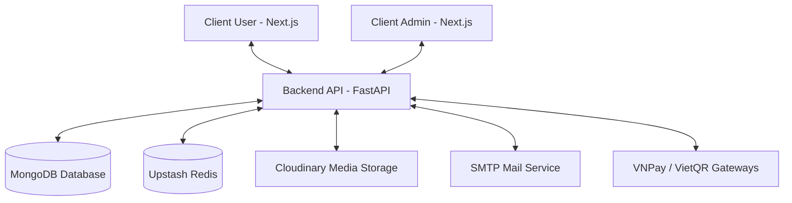

# 🍿 Snack Viet - Hệ Thống Website Bán Đồ Ăn Vặt Trực Tuyến

Chào mừng bạn đến với **Snack Viet**, một hệ thống thương mại điện tử hiện đại chuyên cung cấp các sản phẩm đồ ăn vặt. Dự án được phát triển theo mô hình Microservices/Monorepo linh hoạt, tích hợp thanh toán điện tử VNPay/VietQR, và hệ thống phân tích quản trị thông minh.

---

## 🛠️ Tổng Quan Kiến Trúc & Công Nghệ

Hệ thống bao gồm các thành phần chính sau:



### 1. Backend (`/server`)
*   **Framework**: [FastAPI](https://fastapi.tiangolo.com/) (Python) - Hiệu năng cao, tự động sinh tài liệu Swagger/ReDoc.
*   **Database**: [MongoDB](https://www.mongodb.com/) kết hợp với thư viện Async [Motor](https://motor.readthedocs.io/).
*   **Caching & Task Queue**: [Upstash Redis](https://upstash.com/) và [Rocketry](https://rocketry.readthedocs.io/) để xử lý các tác vụ nền (cron jobs, tự động hủy đơn, cập nhật khuyến mãi).
*   **Media**: [Cloudinary](https://cloudinary.com/) phục vụ lưu trữ hình ảnh sản phẩm và người dùng.
*   **Cổng Thanh Toán**: Tích hợp **VNPay** và tự động tạo mã QR **VietQR** (Napas247).
*   **Email**: Gửi thông báo xác nhận đơn hàng, OTP hoàn tiền qua Gmail SMTP.

### 2. Client User (`/client-user`)
*   **Framework**: [Next.js 16](https://nextjs.org/) (React 19, TypeScript).
*   **State Management**: [Redux Toolkit](https://redux-toolkit.js.org/) và `redux-persist`.
*   **Styling**: [Tailwind CSS v4](https://tailwindcss.com/) & [Shadcn UI](https://ui.shadcn.com/) đem lại giao diện người dùng mượt mà, phản hồi tốt.
*   **Tính Năng**: Xem danh mục sản phẩm, tìm kiếm, giỏ hàng, thanh toán trực tuyến, theo dõi đơn hàng, đánh giá sản phẩm.

### 3. Client Admin (`/client-admin`)
*   **Framework**: [Next.js 16](https://nextjs.org/) (React 19, TypeScript).
*   **Styling**: [Tailwind CSS v4](https://tailwindcss.com/) & [Shadcn UI](https://ui.shadcn.com/) tích hợp [Recharts](https://recharts.org/) để vẽ biểu đồ thống kê.
*   **Tính Năng**: Quản lý sản phẩm, danh mục, thương hiệu, quản lý đơn hàng, duyệt yêu cầu hoàn tiền, theo dõi doanh thu trực quan, cấu hình mã giảm giá và cài đặt hệ thống.

---

## 📂 Cấu Trúc Thư Mục Dự Án

```text
web-ban-do-an-vat/
├── client-user/          # Mã nguồn ứng dụng dành cho Khách hàng (Next.js)
├── client-admin/         # Mã nguồn ứng dụng dành cho Quản trị viên (Next.js)
├── server/               # Mã nguồn FastAPI Backend API (Python)
├── báo cáo/              # Tài liệu báo cáo dự án (.md / .docx)
└── README.md             # Tài liệu hướng dẫn sử dụng hệ thống này
```

---

## 🚀 Hướng Dẫn Cài Đặt & Khởi Chạy

### 1. Chuẩn bị Môi trường
Trước khi bắt đầu, hãy đảm bảo máy tính của bạn đã cài đặt:
*   [Node.js](https://nodejs.org/) (Phiên bản v18 trở lên)
*   [Python](https://www.python.org/) (Phiên bản v3.10 trở lên)
*   Tài khoản [MongoDB Atlas](https://www.mongodb.com/cloud/atlas) hoặc MongoDB local.
*   Tài khoản [Cloudinary](https://cloudinary.com/) (Lấy API Keys).
*   Tài khoản [Upstash](https://upstash.com/) (Đăng ký Redis instance miễn phí).

---

### 2. Thiết lập cấu hình biến môi trường (`.env`)
Tại mỗi thư mục dịch vụ, chúng tôi đã tạo sẵn file `.env.example`. Hãy sao chép chúng thành `.env` và điền đầy đủ các thông tin:

*   **Cho Backend API (`/server`)**:
    ```bash
    cd server
    cp .env.example .env
    ```
    *(Mở file `.env` và cập nhật các khóa kết nối tới MongoDB, Cloudinary, Gmail, VNPay, và Upstash Redis).*

*   **Cho Client User (`/client-user`)**:
    ```bash
    cd ../client-user
    cp .env.example .env
    ```

*   **Cho Client Admin (`/client-admin`)**:
    ```bash
    cd ../client-admin
    cp .env.example .env
    ```

---

### 3. Cài đặt và Khởi chạy các dịch vụ

#### A. Khởi chạy Backend (`/server`)
1.  Di chuyển vào thư mục `server`:
    ```bash
    cd server
    ```
2.  Tạo môi trường ảo Python và kích hoạt:
    ```bash
    python -m venv venv
    # Trên Windows:
    .\venv\Scripts\activate
    # Trên macOS/Linux:
    source venv/bin/activate
    ```
3.  Cài đặt các gói phụ thuộc:
    ```bash
    pip install -r requirements.txt
    ```
4.  Khởi chạy máy chủ FastAPI (chạy mặc định cổng 8000):
    ```bash
    uvicorn app.main:app --reload --port 8000
    ```
    *Tài liệu Swagger API sẽ có sẵn tại: [http://localhost:8000/docs](http://localhost:8000/docs)*

#### B. Khởi chạy Client User (`/client-user`)
1.  Di chuyển vào thư mục `client-user`:
    ```bash
    cd client-user
    ```
2.  Cài đặt các gói npm:
    ```bash
    npm install
    ```
3.  Khởi chạy Next.js ở chế độ phát triển:
    ```bash
    npm run dev
    ```
    *Ứng dụng sẽ chạy tại địa chỉ: [http://localhost:3000](http://localhost:3000)*

#### C. Khởi chạy Client Admin (`/client-admin`)
1.  Di chuyển vào thư mục `client-admin`:
    ```bash
    cd client-admin
    ```
2.  Cài đặt các gói npm:
    ```bash
    npm install
    ```
3.  Khởi chạy Next.js ở chế độ phát triển:
    ```bash
    npm run dev
    ```
    *Ứng dụng quản trị sẽ chạy tại địa chỉ: [http://localhost:3001](http://localhost:3001)*

---

## 💳 Quy Trình Thanh Toán Tích Hợp
1.  **VietQR**: Hệ thống tự động tạo mã QR chứa thông tin số tài khoản, số tiền và nội dung chuyển khoản bằng API từ Ngân hàng (dựa trên cấu hình `BANK_BIN`, `ACCOUNT_NO` trong `.env` của Backend). Khách hàng có thể quét mã trực tiếp trên ứng dụng Ngân hàng của mình.
2.  **VNPay**: Khách hàng chọn phương thức VNPay sẽ được điều hướng tới cổng thanh toán VNPay Sandbox để nhập thông tin thẻ test. Sau khi hoàn tất thanh toán, VNPay sẽ gửi kết quả phản hồi về URL callback của backend để cập nhật trạng thái đơn hàng thời gian thực.

## 📝 Tài Liệu Báo Cáo
Để xem chi tiết kế hoạch thực hiện, phân tích yêu cầu phần mềm và sơ đồ lớp thiết kế chi tiết, vui lòng truy cập thư mục [báo cáo](file:///d:/web%20ban%20do%20an%20vat/b%C3%A1o%20c%C3%A1o/) chứa các chương tài liệu định dạng Markdown.

---
*Chúc bạn có những trải nghiệm tuyệt vời cùng Snack Viet!* 🍿🔥
