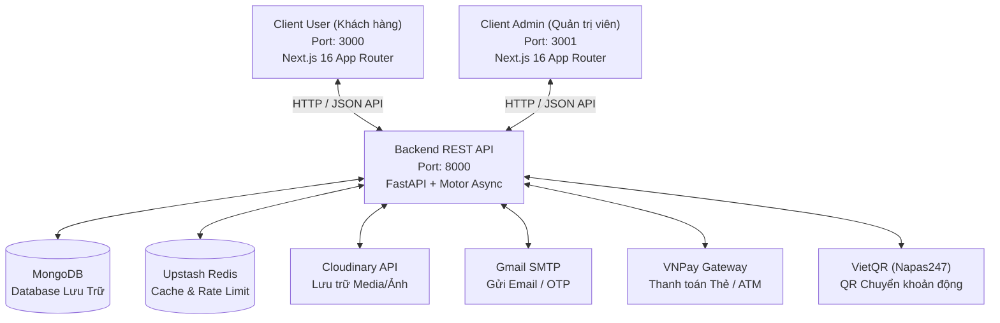

# 🍿 Snack Viet - Hệ Thống Website Thương Mại Điện Tử Đồ Ăn Vặt

Hệ thống thương mại điện tử chuyên cung cấp các sản phẩm đồ ăn vặt trực tuyến **Snack Viet**, được thiết kế theo kiến trúc hiện đại, tách biệt hoàn toàn giữa **Backend API (FastAPI)**, **Client Khách hàng (Next.js 16)** và **Client Quản trị Admin (Next.js 16)**. Hệ thống hỗ trợ thanh toán trực tuyến qua **VNPay** và **VietQR**, quản lý đơn hàng theo thời gian thực.

---

## 📑 Mục Lục

- [Kiến Trúc Tổng Quan](#-kiến-trúc-tổng-quan)
- [Cấu Trúc Thư Mục](#-cấu-trúc-thư-mục)
- [Công Nghệ Sử Dụng](#-công-nghệ-sử-dụng)
- [Yêu Cầu Tiền Đề](#-yêu-cầu-tiền-đề)
- [Cấu Hình Biến Môi Trường (.env)](#-cấu-hình-biến-môi-trường-env)
- [Hướng Dẫn Cài Đặt & Khởi Chạy](#-hướng-dẫn-cài-đặt--khởi-chạy)
  - [1. Khởi chạy Backend API (FastAPI)](#1-khởi-chạy-backend-api-fastapi)
  - [2. Khởi chạy Client User (Storefront)](#2-khởi-chạy-client-user-storefront)
  - [3. Khởi chạy Client Admin (Dashboard)](#3-khởi-chạy-client-admin-dashboard)
- [Bảng Cổng (Port) & Đường Dẫn Dịch Vụ](#-bảng-cổng-port--đường-dẫn-dịch-vụ)
- [Quy Trình Tích Hợp Thanh Toán](#-quy-trình-tích-hợp-thanh-toán)
- [Tài Liệu Chi Tiết Từng Module](#-tài-liệu-chi-tiết-từng-module)

---

## 🏛️ Kiến Trúc Tổng Quan


```mermaid
graph TD
    User["Client User (Khách hàng)<br/>Port: 3000<br/>Next.js 16 App Router"]
    Admin["Client Admin (Quản trị viên)<br/>Port: 3001<br/>Next.js 16 App Router"]
    Backend["Backend REST API<br/>Port: 8000<br/>FastAPI + Motor Async"]

    MongoDB[("MongoDB<br/>Database Lưu Trữ")]
    Redis[("Upstash Redis<br/>Cache & Rate Limit")]
    Cloudinary["Cloudinary API<br/>Lưu trữ Media/Ảnh"]
    SMTP["Gmail SMTP<br/>Gửi Email / OTP"]
    VNPay["VNPay Gateway<br/>Thanh toán Thẻ / ATM"]
    VietQR["VietQR (Napas247)<br/>QR Chuyển khoản động"]

    User <-->|HTTP / JSON API| Backend
    Admin <-->|HTTP / JSON API| Backend
    Backend <--> MongoDB
    Backend <--> Redis
    Backend <--> Cloudinary
    Backend <--> SMTP
    Backend <--> VNPay
    Backend <--> VietQR
```

---

## 📂 Cấu Trúc Thư Mục

```text
Web_TMDT/
├── server/               # Backend API xây dựng với FastAPI (Python)
│   ├── app/              # Mã nguồn logic backend (routers, models, services,...)
│   ├── scripts/          # Script hỗ trợ (đánh indexes MongoDB, migration,...)
│   ├── requirements.txt  # Danh sách dependencies Python
│   ├── .env.example      # Cấu hình biến môi trường mẫu cho server
│   └── README.md         # Hướng dẫn chi tiết cho Backend
├── client-user/          # Giao diện mua hàng dành cho Khách hàng (Next.js 16)
│   ├── app/              # Next.js App Router (Layouts, Pages, Routes)
│   ├── components/       # UI Components tái sử dụng (Shadcn UI, Radix)
│   ├── store/            # Redux Toolkit store & slices
│   ├── services/         # Tầng gọi API Backend
│   ├── .env.example      # Cấu hình biến môi trường mẫu cho Client User
│   └── README.md         # Hướng dẫn chi tiết cho Client User
├── client-admin/         # Giao diện Dashboard Quản trị viên (Next.js 16)
│   ├── app/              # Next.js App Router (Admin pages, Reports, Marketing)
│   ├── components/       # Bảng biểu, Form, Charts (Recharts)
│   ├── store/            # Redux Toolkit store
│   ├── services/         # Tầng gọi API Backend
│   ├── .env.example      # Cấu hình biến môi trường mẫu cho Client Admin
│   └── README.md         # Hướng dẫn chi tiết cho Client Admin
├── .gitignore            # Cấu hình git ignore toàn dự án
└── README.md             # Tài liệu tổng quan hệ thống (file này)
```

---

## 🛠️ Công Nghệ Sử Dụng

### 1. Backend Service
- **Ngôn ngữ & Framework**: Python 3.10+, [FastAPI](https://fastapi.tiangolo.com/), Uvicorn ASGI.
- **Cơ sở dữ liệu**: [MongoDB](https://www.mongodb.com/) (thông qua [Motor](https://motor.readthedocs.io/) async driver).
- **Bộ nhớ đệm & Bộ đếm**: [Upstash Redis](https://upstash.com/).
- **Tác vụ lập lịch (Cron jobs)**: [Rocketry](https://rocketry.readthedocs.io/) (hủy đơn hết hạn, quét coupon hết hạn, dọn dẹp OTP).
- **Xác thực & Bảo mật**: JWT (JSON Web Tokens), OAuth2 Google, Passlib (bcrypt), Session middleware.
- **Dịch vụ tích hợp**: Cloudinary (Upload ảnh sản phẩm/banner), Gmail SMTP (Gửi OTP hoàn tiền, thông báo đơn hàng), VNPay Gateway & VietQR Napas247.

### 2. Frontend Applications (Client User & Client Admin)
- **Framework**: [Next.js 16](https://nextjs.org/) (App Router), React 19, TypeScript.
- **Styling**: [Tailwind CSS v4](https://tailwindcss.com/), [Shadcn UI](https://ui.shadcn.com/), [Radix UI primitives](https://www.radix-ui.com/).
- **Quản lý State & Dữ liệu**: Redux Toolkit, Redux Persist, TanStack React Query.
- **Biểu đồ & Trực quan hóa**: [Recharts](https://recharts.org/).
- **HTTP Client & Form**: Axios (kèm Interceptors), React Hook Form, Zod & Yup validation.

---

## 📋 Yêu Cầu Tiền Đề

Đảm bảo môi trường máy của bạn đã cài đặt các công cụ sau:
- **Node.js**: Phiên bản `>= 18.17.0` (Khuyên dùng v20 LTS).
- **Python**: Phiên bản `>= 3.10` (Khuyên dùng 3.10.x hoặc 3.11.x).
- **Git**: Bản mới nhất.
- **MongoDB**: Đã cài đặt MongoDB Community Server chạy local (`mongodb://localhost:27017`) hoặc URI kết nối MongoDB Atlas.

---

## ⚙️ Cấu Hình Biến Môi Trường (.env)

Trước khi chạy hệ thống, sao chép các file `.env.example` thành `.env` (hoặc `.env.local`) tại 3 thư mục:

```bash
# 1. Cấu hình Backend
cd server
cp .env.example .env

# 2. Cấu hình Client User
cd ../client-user
cp .env.example .env.local

# 3. Cấu hình Client Admin
cd ../client-admin
cp .env.example .env.local
```

> **Lưu ý:** Vui lòng cập nhật các giá trị thông tin xác thực thật (MongoDB URL, Cloudinary Keys, VNPay Sandbox, Mail SMTP) vào file `server/.env`.

---

## 🚀 Hướng Dẫn Cài Đặt & Khởi Chạy

Khởi chạy đồng thời 3 terminal độc lập cho từng dịch vụ:

### 1. Khởi chạy Backend API (FastAPI)

```bash
# Di chuyển vào thư mục server
cd server

# Tạo môi trường ảo Python
python -m venv venv

# Kích hoạt môi trường ảo:
# Trên Windows (PowerShell):
.\venv\Scripts\activate
# Trên macOS / Linux:
source venv/bin/activate

# Cài đặt các thư viện phụ thuộc
pip install -r requirements.txt

# (Khuyên dùng) Tạo index cơ sở dữ liệu để tối ưu truy vấn
python scripts/create_indexes.py

# Khởi chạy server FastAPI với chế độ hot-reload
uvicorn app.main:app --reload --port 8000
```

### 2. Khởi chạy Client User (Storefront)

```bash
# Mở terminal mới và di chuyển vào client-user
cd client-user

# Cài đặt các gói phụ thuộc
npm install

# Khởi chạy máy chủ phát triển (mặc định cổng 3000)
npm run dev
```

### 3. Khởi chạy Client Admin (Dashboard)

```bash
# Mở terminal mới và di chuyển vào client-admin
cd client-admin

# Cài đặt các gói phụ thuộc
npm install

# Khởi chạy máy chủ phát triển (mặc định cổng 3001)
npm run dev
```

---

## 🌐 Bảng Cổng (Port) & Đường Dẫn Dịch Vụ

| Dịch vụ | URL Local | Cổng | Ghi chú |
| :--- | :--- | :--- | :--- |
| **Client User** | [http://localhost:3000](http://localhost:3000) | `3000` | Trang web mua sắm cho khách hàng |
| **Client Admin** | [http://localhost:3001](http://localhost:3001) | `3001` | Dashboard quản lý cho Quản trị viên |
| **Backend API** | [http://localhost:8000](http://localhost:8000) | `8000` | API RESTful gốc |
| **Swagger UI Docs** | [http://localhost:8000/docs](http://localhost:8000/docs) | `8000` | Tài liệu API tương tác tự động |
| **ReDoc UI Docs** | [http://localhost:8000/redoc](http://localhost:8000/redoc) | `8000` | Tài liệu API bản thu gọn |

---

## 💳 Quy Trình Tích Hợp Thanh Toán

1. **VietQR (Napas247)**:
   - Hệ thống tự động tạo mã QR chuyển khoản dựa trên ngân hàng thụ hưởng (`BANK_BIN`, `ACCOUNT_NO`, `ACCOUNT_NAME`).
   - Mã QR chứa sẵn số tiền và mã hóa đơn để người dùng chỉ cần mở app ngân hàng và quét thanh toán không cần nhập tay.
2. **VNPay Gateway**:
   - Khi chọn VNPay, hệ thống sinh URL chuyển tiếp sang Cổng thanh toán Sandbox của VNPay kèm chữ ký số bảo mật HMAC-SHA512.
   - Sau khi khách hàng thanh toán xong trên cổng VNPay, kết quả được đồng bộ về hệ thống qua Webhook IPN (`/api/payment/vnpay_ipn`) và điều hướng người dùng về trang hiển thị kết quả (`/payment-result`).

---

## 📖 Tài Liệu Chi Tiết Từng Module

Để xem hướng dẫn chi tiết theo từng phân hệ, vui lòng đọc các tài liệu riêng biệt:
- 📖 [Hướng dẫn chi tiết Backend API](server/README.md)
- 📖 [Hướng dẫn chi tiết Client User](client-user/README.md)
- 📖 [Hướng dẫn chi tiết Client Admin](client-admin/README.md)
